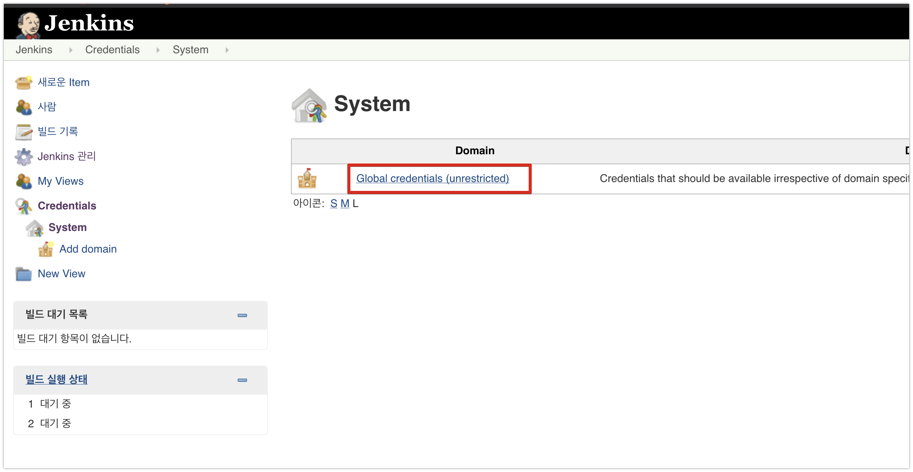
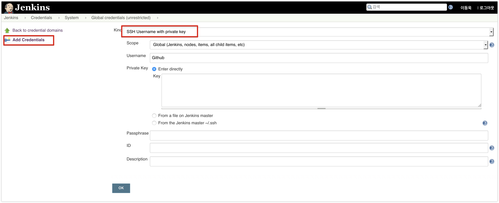
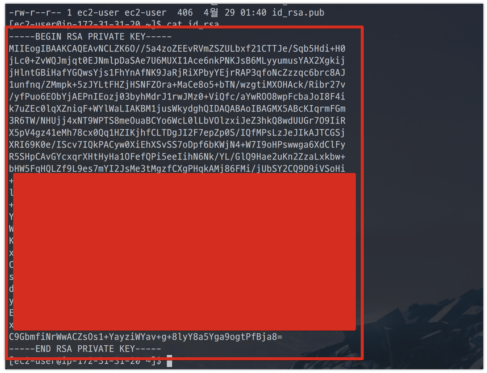
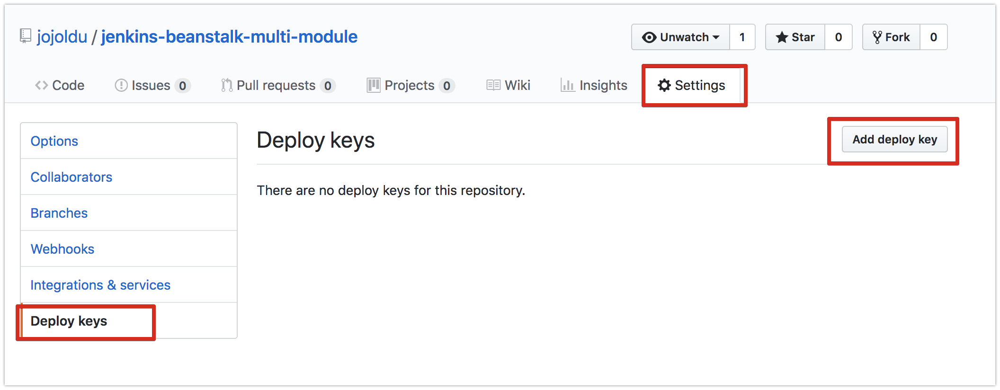
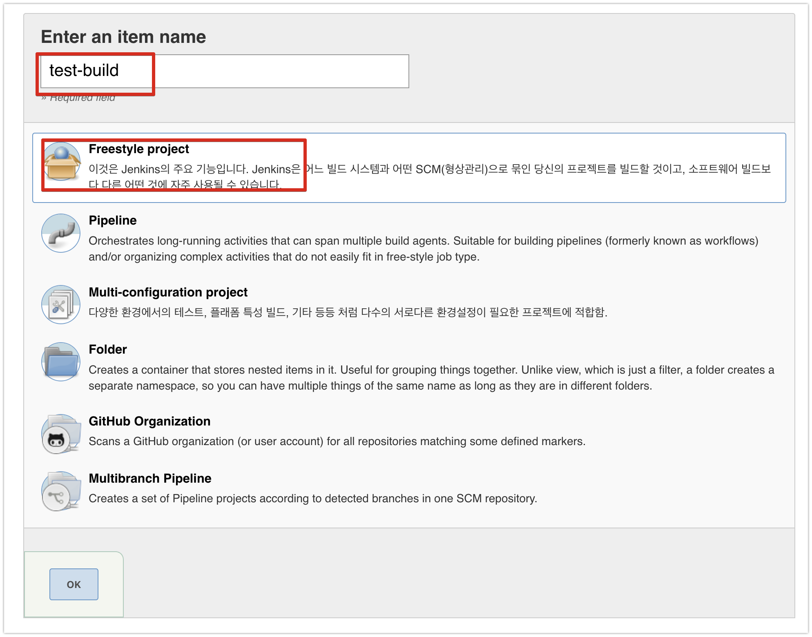
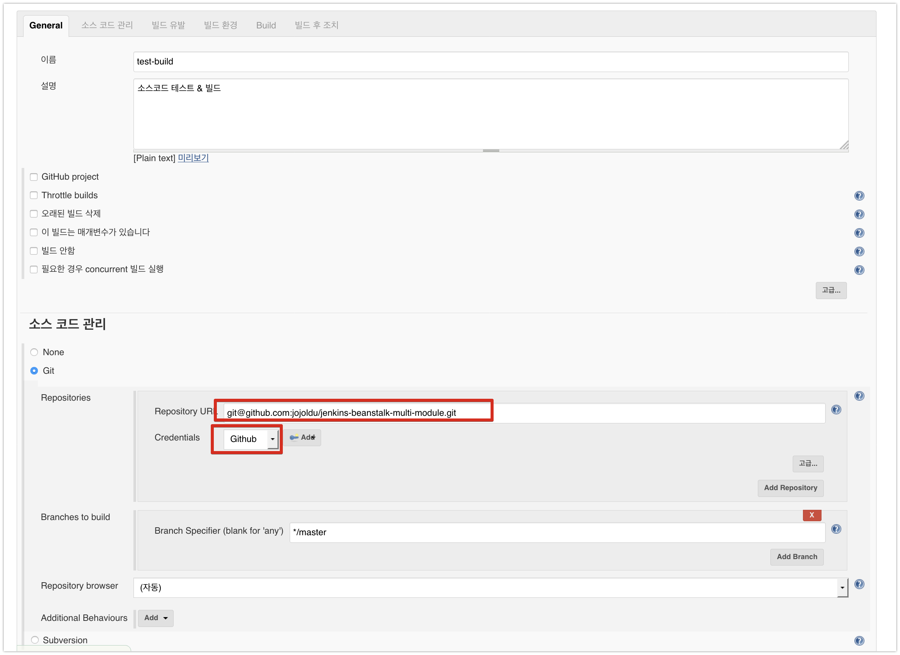
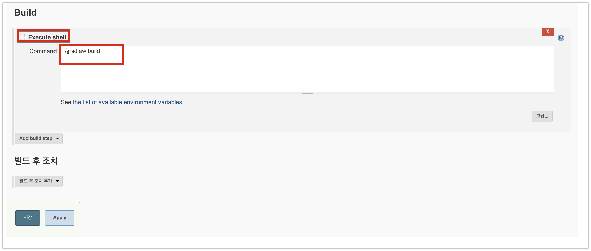

# 2. EC2에 설치된 Jenkins와 Github 연동하기

이번 시간엔 EC2에 설치된 Jenkins와 Github연동을 진행하겠습니다.

## 2-1. SSH 키 생성 및 등록

Github 연동을 **ID & Password 방식으로 하면 보안에 취약**하기 때문에 ssh 키로 연동 하겠습니다.  
Jenkins가 설치된 EC2에서 아래 명령어로 키를 생성합니다.

```bash
ssh-keygen -t rsa -f id_rsa
```

(여기서 ```Enter passphrase```는 바로 엔터를 누르시면 됩니다.)  
  
2개의 키(```id_rsa```, ```id_rsa.pub```)가 생성됩니다.  
  


Jenkins 페이지로 다시 이동하셔서 **Credentials/System**로 이동합니다.


Global credentials를 클릭



**Add Credentials**를 클릭하면 인증키를 입력할 수 있는 화면이 나옵니다.  
여기서 Kind를 **SSH Username with private key**를 선택합니다.



여기서 Private Key 영역에 **id_rsa** 값을 넣습니다.  
Jenkins가 설치된 EC2에서 ```cat id_rsa```로 코드를 확인합니다.



이 코드를 **전체 복사**해서 Key 영역에 추가합니다.  


개인키(id_rsa)는 이제 등록이 되었습니다.  
공개키(id_rsa.pub)를 Github에 등록하겠습니다.  
Jenkins로 관리할 Github 프로젝트로 이동하신뒤 **Settings**탭 -> Deploy keys -> Add deploy key를 차례로 클릭합니다.  



EC2에 있는 공개키(id_rsa.pub) 코드를 복사해 Key에 입력합니다.

```bash
cat id_rsa.pub 
```


여기서 write access는 체크하지 않습니다.  
(Jenkins에서 별도로 Github 코드를 수정할 일이 없습니다.)  
  


등록이 완료되면 아래처럼 SSH 키 등록된것을 확인할 수 있습니다.


이제 Jenkins에서 Github 코드를 가져올 수 있습니다!  
이것만 해도 Build, Test, Code Clone등을 다 할 수 있는데요.  
한가지 작업을 더 해보겠습니다.  
Github에 Push가 발생하면 Jenkins가 push 이벤트를 받을 수 있도록 하겠습니다.  
똑같이 Settings 탭에서 Webhooks 탭 -> Add webhook을 차례로 클릭합니다.


아래와 같이 값을 채웁니다.


Payload URL은 ```http://Jenkins도메인/github-webhook/```로 등록하시면 됩니다.  

> github-webhook/ 에서 ```/```는 꼭 넣으셔야 문제가 없습니다.

정상적으로 등록하셨으면 아래처럼 체크 표시가 된것을 볼 수 있습니다.


자 Github 작업은 모두 완료 되었습니다!  
이제 Jenkins에 실제 Build & Test를 수행할 Item을 등록해보겠습니다.

## 2-2. Jenkins Item 등록

Jenkins의 메인 화면 좌측의 **새로운 Item**을 클릭합니다.


본인이 원하는 Item이름을 등록하시고, Freestyle project를 선택합니다.



**소스 코드 관리** 항목에서 Repository 주소를 Github 프로젝트 주소를 등록합니다.  
여기서 주소 양식은 아래처럼 해주셔야 합니다.

```bash
git@github.com:Github사용자명/프로젝트명.git
```

Credentials는 2-1에서 등록한 (id_rsa) ssh키를 선택합니다.  



빌드 유발 (현재 만드는 Item을 어떤 방법으로 실행시킬지)에선 **Github hook trigger**를 선택합니다.  
즉, Github에 push 이벤트가 오면 자동으로 실행시키게 됩니다.  


Build에선 Execute shell을 선택해서 직접 shell을 작성하면 됩니다.  
여기선 간단하게 Gradle Wrapper로 build를 수행하겠습니다.

```bash
./gradlew build
```



자 Item이 생성되었으면, 테스트 삼아 Github 프로젝트에 Push를 한번 해봅니다.  
그러면!


이렇게 자동으로 Jenkins Item이 실행되는걸 볼 수 있습니다.  
상세하게 내역을 보시면


Github의 push로 실행됐음을 알 수 있습니다.  
시간이 조금 지나면 Test와 Build가 모두 성공적으로 끝납니다.


이제 EC2에 설치된 Jenkins와 Github의 연동까지 끝났습니다!  
다음 시간에는 이렇게 구성된 환경에서 AWS Beanstalk 배포를 연결해보겠습니다!  
감사합니다 :)


